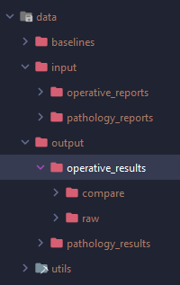

# EMR_pipeline
to install dependencies, run 
```
pip install -r requirements.txt
```

This repository does not contain the folders for data input and output.

- Step 1: Create a data folder with 4 subfolders. These 4 subfolders are baselines, input, output, utils.

- Step 2: In the input folder, make two subfolders, one named operative_reports and the other one named pathology_reports.

- Step 3: In the output folder, make two subfolders, one named operative_results and the other named pathology_results. 

- Step 4: In the data/output/operative_results folder, make two subfolders, one named compare and the other named raw. 

It should look something like this! 

